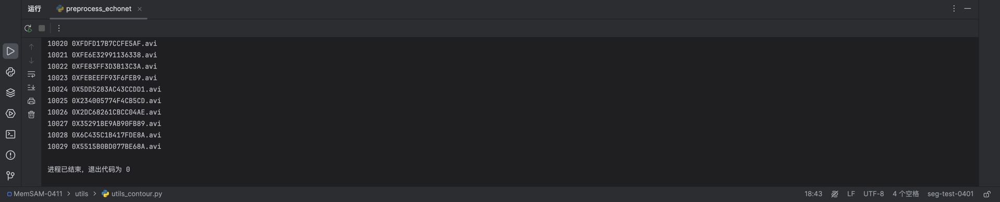
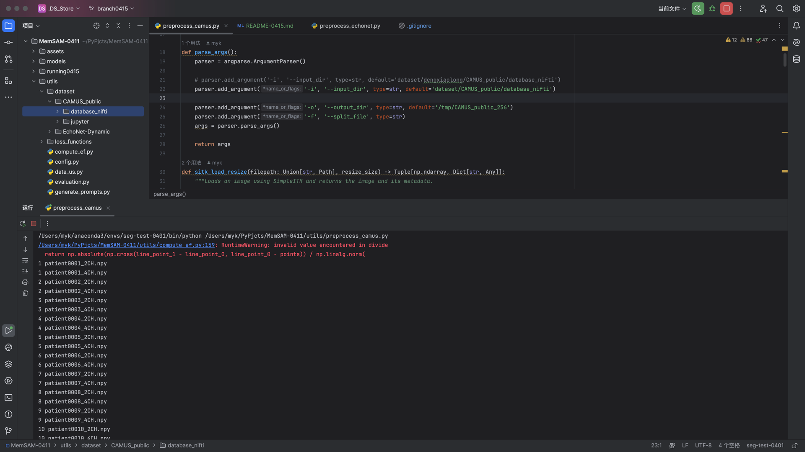
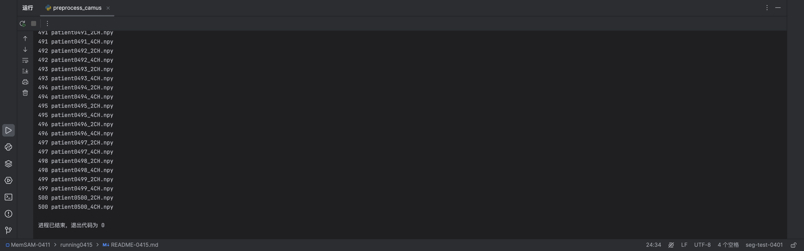
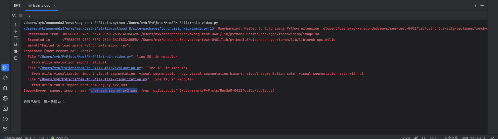

# MemSAM

0415

**MemSAM: Taming Segment Anything Model for Echocardiography Video Segmentation**, CVPR 2024

<!-- The code will be uploaded later. -->

## Installation
```
conda create --name memsam python=3.10
conda activate memsam
pip install torch torchvision --index-url https://download.pytorch.org/whl/cu118
pip install requirements.txt
```

## Usage
### prepare dataset
First, download the dataset from:
- [CAMUS](https://www.creatis.insa-lyon.fr/Challenge/camus/index.html)
- [EchoNet-Dynamic](https://echonet.github.io/dynamic/index.html)
  
Then process the dataset according to `utils/preprocess_echonet.py` and `utils/preprocess_camus.py`.

把dataset放在`utils/dataset/CAMUS_public`

更改`utils/preprocess_camus.py`，运行，如图



### pretrain checkpoint download
[ViT-B SAM model](https://dl.fbaipublicfiles.com/segment_anything/sam_vit_b_01ec64.pth)

放在哪里？

### train and test
Use `train_video.py` and `test_video.py` to train and test separately.

这是怎么会是


## Acknowledgement
The work is based on [SAM](https://github.com/facebookresearch/segment-anything), [SAMUS](https://github.com/xianlin7/SAMUS) and [XMem](https://github.com/hkchengrex/XMem). Thanks for the open source contributions to these efforts!

## Citation
if you find our work useful, please cite our paper.
```
@inproceedings{deng2024memsam,
  title={MemSAM: Taming Segment Anything Model for Echocardiography Video Segmentation},
  author={Deng, Xiaolong and Wu, Huisi and Zeng, Runhao and Qin, Jing},
  booktitle={Proceedings of the IEEE/CVF Conference on Computer Vision and Pattern Recognition},
  year={2024}
}
```
